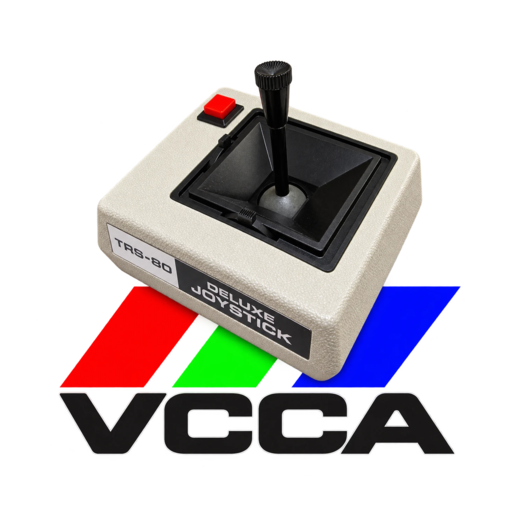
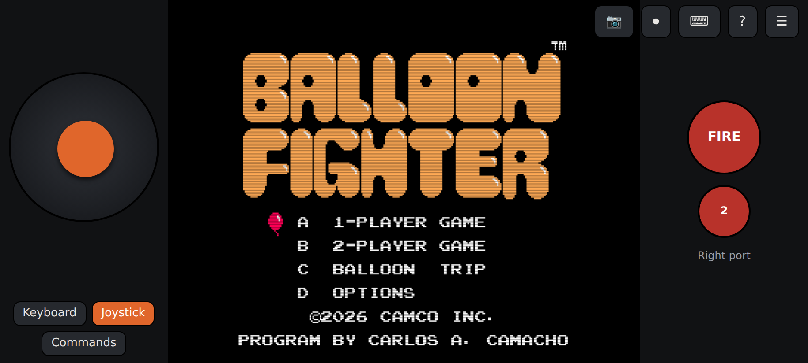
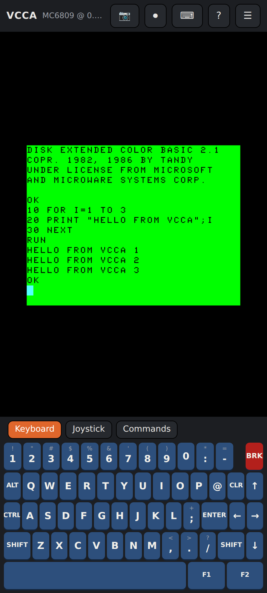
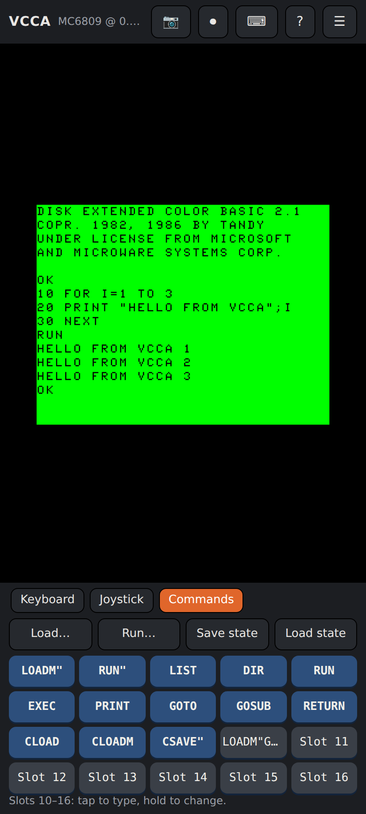
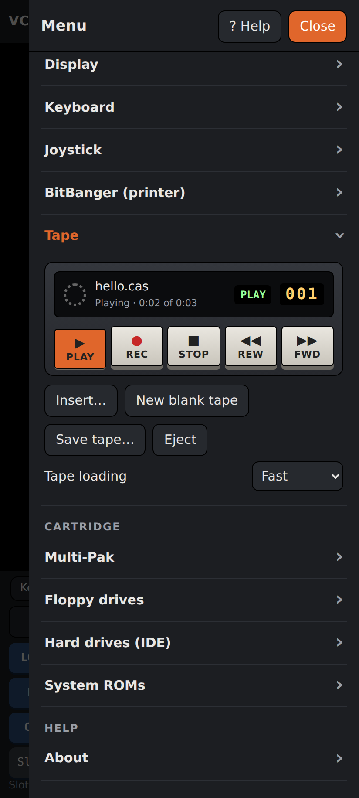
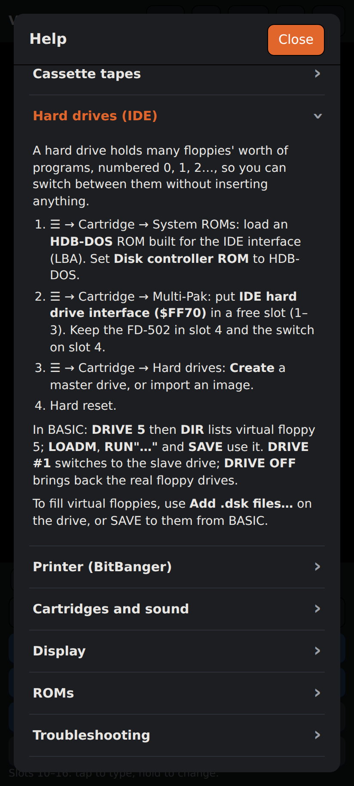

<p align="center">
  
</p>

# VCCA — VCC for Android

**VCCA** is a Tandy Color Computer 3 emulator for Android phones and tablets.
It runs the emulation core of [VCC (Virtual Color Computer)](https://github.com/VCCE/VCC),
the CoCo 3 emulator for Windows, with a touch front end: a CoCo 3 keyboard,
an on-screen joystick, a tape deck, floppy and IDE hard drives, and the
Multi-Pak sound cartridges.

Android port by **Carlos A. Camacho**.

<p align="center">
  
</p>
<p align="center"><sub><i>Balloon Fighter</i> by Carlos A. Camacho, in landscape with the on-screen joystick.</sub></p>

<p align="center">
  
  
  
  
</p>

## Install

Download `VCCA.apk` from [Releases](https://github.com/CarlosCamacho/vcca/releases)
and open it on your device. Android asks once to allow installs from your
browser or file manager. Needs Android 7.0 or later.

VCCA needs the CoCo 3's own ROM, which is copyrighted and not included. On
first start, pick **coco3.rom** (required) and **disk11.rom** (for floppies).
If you use VCC on Windows, both are in its folder.

## Reporting bugs

Found something that doesn't work? [Open a bug report](https://github.com/CarlosCamacho/vcca/issues/new/choose).
The form asks for your VCCA version, device and the steps to reproduce it.
See [CONTRIBUTING.md](CONTRIBUTING.md) for more.

## Features

**Machine**
- CoCo 3 with a Motorola 6809 or Hitachi 6309, 128K to 8 MB, RGB or composite monitor
- Double-speed overclock; normal or fast-as-possible speed
- Save states: freeze the whole machine and come back to that exact moment, from the Commands tab or to a file
- Screenshots (PNG) and video with sound (MP4 where the device supports it)
- Scan lines drawn at the screen's own resolution, so they stay even at any size

**Loading, like XRoar**
- **Load…** / **Run…** take `.bin`, `.dsk`, `.cas`, `.wav`, `.rom` and `.ccc`. Run reads the disk directory or tape header and types the right `RUN"…"`, `LOADM"…":EXEC`, `CLOAD` or `CLOADM:EXEC`

**Storage**
- Four FD-502 floppy drives (`.dsk`), with blank disks and saving images back to the device
- Cassette deck: PLAY, REC, STOP, REW and FWD (skips to the next program); `.cas` and any `.wav`; VCC's fast loading
- IDE hard drives through HDB-DOS: numbered virtual floppies, created in the app or imported, with `.dsk` files added in bulk

**Cartridges (Multi-Pak)**
- FD-502 disk controller, program paks, Orchestra-90 CC, Speech/Sound Pak, Game Master Cartridge
- Stereo Composer, Symphony 12 and CoCo PSG, which need no ROM
- Glenside-compatible IDE interface at `$FF70` or `$FF50`

**Input**
- On-screen CoCo 3 keyboard in the XRoar layout, with sticky SHIFT, CTRL and ALT
- Physical keyboards, with VCC's special keys (F3/F4 overclock, F5 reset, F6 monitor, F7 pause, F8 throttle, F9 hard reset, F11 full screen)
- Left and right joystick ports, as in VCC: on-screen stick or game controller, touch on screen, keyboard, or none. Standard, Tandy Hi-Res or CC-MAX emulation per port
- In landscape: stick, screen and fire buttons side by side, swappable for left-handed play
- **Commands** tab: one-tap `LOADM"`, `RUN"`, `LIST`, `DIR`, `RUN`, `EXEC`, `CLOAD`, `CLOADM`, `CSAVE"` and more, plus seven slots for your own commands

**Other**
- BitBanger printer capture (`LLIST`, `PRINT#-2`) to text
- Type a whole BASIC listing in, or copy the screen's text out
- ROMs, disks, tapes and settings stay on the device between runs
- Built-in Help covers every feature, including step-by-step hard drive setup, and **Report a bug** opens the bug form with your version and device filled in

## How it works

VCC is C++ written for Win32. VCCA compiles its emulation core to
WebAssembly and runs it in an Android WebView, with the front end in HTML and
JavaScript.

```
core/      VCC's sources, edited only where Windows got in the way
           (CPUs, GIME, PIAs, FD-502, Speech/Sound Pak, GMC, keyboard, joystick)
compat/    a minimal Windows.h and friends
port/      host.cpp   reset sequence, frame and audio hand-off, exported calls
           pak.cpp    Multi-Pak and cartridges (VCC's, plus MAME's Stereo Composer,
                      Symphony 12, CoCo PSG and Glenside IDE, ported)
           tape.cpp   VCC's Cassette.cpp, reading the front end's tape file
           vfs.cpp    Win32 file calls answered by the front end
web/       the front end: screen, keyboard, joystick, audio, menus, help
android/   manifest, activity, icons and the APK build script
           (icon.sh makes the icons from assets/icon/vcca-icon.png)
test/      6809 test ROMs and Node/Playwright test harnesses
```

Disk, tape and hard drive images live on the JavaScript side, reached
through imported functions, so a save state (a copy of the WebAssembly
memory) stays small and never rolls back a disk. A save state loads only in
the build that made it, checked by a hash of `vcc.wasm`.

Cartridge audio follows VCC: two 8-bit channels packed in a word, the high
byte to the right speaker. Every cartridge with a sound output reports it
explicitly, because a sample of `$00` is a real level, not silence.

## Building

Ubuntu 24.04 packages:

```
sudo apt install clang lld wasi-libc libc++-dev-wasm32 libclang-rt-dev-wasm32 \
  android-sdk-platform-23 aapt apksigner zipalign android-sdk-build-tools default-jdk
```

Then:

```
./build.sh                                   # -> out/vcc.wasm
VCCA_KEYSTORE_PASS=… ./android/build-apk.sh  # -> out/VCCA.apk
```

The signing key is not in this repository. `build-apk.sh` uses
`android/vcc-release.keystore`, or `$VCCA_KEYSTORE`, and makes a new key if
there is none. An update installs over an existing app only if it is signed
with the same key, so a build signed with a different key must be installed
fresh. The package ID stays `com.vcce.vcc` for the same reason.

To try the front end in a desktop browser, copy `out/vcc.wasm` into `web/`
and serve that folder, for example `python3 -m http.server 8765` in `web/`.

### HDB-DOS

HDB-DOS is not included, because it contains Disk BASIC code. Build it from
ToolShed (needs [LWTOOLS](http://www.lwtools.ca/)):

```
git clone https://github.com/nitros9project/toolshed
make -C toolshed/cocoroms ecb_equates.asm
make -C toolshed/hdbdos hdblba.rom      # IDE, LBA, at $FF70
```

Load `hdblba.rom` in VCCA under Cartridge → System ROMs, and set
**Disk controller ROM** to HDB-DOS.

### Tests

The harnesses drive the real front end in Chromium. Put `coco3.rom` and
`disk11.rom` in `roms/` (git ignores it, along with every `.rom`), install
Playwright with `npm i playwright`, serve `web/` on port 8765, then for
example:

```
node test/tape.mjs      # CSAVE, CLOAD, CSAVEM, CLOADM, and .wav loading through Run
node test/tape5.mjs     # FWD to the second program on .cas and .wav tapes
node test/ui12.mjs      # printer capture, joystick ports, function keys
```

`testrom.asm`, `soundrom.asm` and `sscrom.asm` are 6809 test ROMs (assembled
with `lwasm`) for the CPU and video, the sound cartridges and Speech/Sound Pak
speech. `test/shots.mjs` makes the screenshots above.

## Not ported yet

The Becker port and DriveWire, VCC's VHD hard disk pak, the SDC, the RS-232
pak and VCC's debugger windows.

## License and credits

VCCA is free software under the [GNU General Public License v3.0](LICENSE)
or (at your option) any later version, as VCC is.

- **[VCC](https://github.com/VCCE/VCC)**, copyright 2015 Joseph Forgione. Repository and
  releases maintained by Bill Pierce and Ed Jaquay. Adapted to Visual Studio
  by Gary Coulbourne and Wes Gale; Hitachi 6309 port by Walter Zambotti. Bug
  fixes and enhancements by Bill Pierce, James Ross, Peter Westberg, James
  Rye, EJ Jaquay, Mike Rojas, Trey Tomes and Craig Allsop. GPL v3.
- **MAME** cartridge drivers, ported (BSD-3-Clause, notices kept in the
  sources): Stereo Composer, Symphony 12 and Speech/Sound Pak by tim lindner;
  CoCo PSG by Roberto Fernandez and Nigel Barnes (thanks to Ed Snider);
  Glenside IDE by Nigel Barnes; Orchestra-90 by Nathan Woods.
- **HDB-DOS** by Boisy G. Pitre and contributors (ToolShed project), not
  included.
- The CoCo 3 and Disk BASIC ROMs are copyrighted by Tandy and Microsoft and
  are not included.
